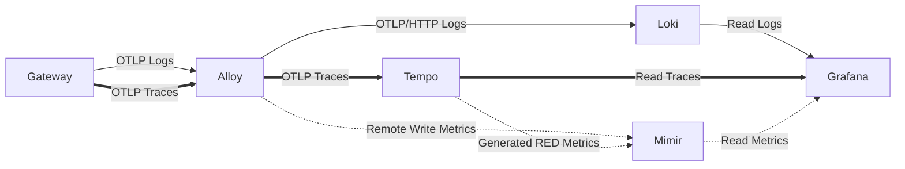

# Observatory

**Self-hosted production-pattern observability stack** showcasing deep LGTM expertise, OpenTelemetry instrumentation, SLOs with burn-rate alerting, and observability as a practice.

Built as a portfolio piece for Grafana engineering roles.



Observatory — self-hosted Grafana LGTM stack with OTel instrumentation

---

## Quick Start (60 seconds)

```bash
git clone https://github.com/MarkusIsaksson1982/observatory.git
cd observatory
cp .env.example .env
make up              # Starts Gateway, Alloy, Loki, Tempo, Mimir, Grafana
cd terraform && terraform apply -auto-approve && cd ..
```

Open **http://localhost:3000** (admin/admin) → explore provisioned dashboards.

```bash
make validate        # Health check all services
```

---

## What This Demonstrates

- **Full LGTM stack**: Loki (logs), Tempo (traces), Mimir (metrics), Grafana.
- **End-to-end telemetry**: OpenTelemetry-instrumented Python FastAPI with traces, metrics, structured logs + traceID correlation.
- **RED dashboards**: Request rate, error rate, latency (p50/p95/p99), service status.
- **SLO practice**: Sloth-generated multi-window multi-burn-rate alerts (99.9% availability, 99.5% <500ms latency).
- **Trace-to-log correlation**: Click a trace → filtered Loki logs.
- **Metrics from traces**: Tempo metrics-generator derives RED metrics with exemplar support.
- **IaC & governance**: ADRs, decision log, validation scripts.

**Live signals flow** from code instrumentation through Alloy into all three backends.

---

## Key Dashboards (Provisioned)

- **service-health-red** – 6 RED panels: request rate, error rate, latency percentiles, service status, volume.
- **slo-burn-rate** – 9 SLO panels: availability, error budget, burn rate (5m/30m), multi-window SLI trend, SLO inventory table.
- **system-overview** – High-level health, aggregate request rate, error budget burn, log volume, Tempo service map.

---

## SLO Targets (Live in Mimir)

- **Availability**: 99.9% successful requests.
- **Latency**: 99.5% of requests < 500ms.
- Burn-rate alerting (fast + slow) + error budget tracking via Sloth.

---

## Tech Stack

- **Core**: Grafana, Loki, Tempo, Mimir, Alloy
- **App**: Python/FastAPI + OpenTelemetry SDK
- **IaC**: Docker Compose (Terraform planned for v0.6.0)
- **SLOs**: Sloth (Google SRE multi-window multi-burn-rate)

---

## Documentation

- [Deployer Guide](./docs/deployer-guide.md) – 3-minute walkthrough for demonstrating the stack.
- [ADRs](./ADR/) – Architecture decisions (Alloy choice, labels, SLOs, metrics source).
- [Decision Log](./DECISION_LOG.md) – Chronological record of all architectural decisions.
- [Portfolio Evidence](./docs/PORTFOLIO_EVIDENCE.md) – Direct mapping to job requirements.

## Tools

- **`tools/load-generator.py`** – Zero-dependency Python load generator for populating dashboards. Rate limiting, error injection, Ctrl+C graceful shutdown. `python tools/load-generator.py --rate 10 --duration 120`

---

**Built with observability as a practice**, not just tools. One-command demo for recruiters.

*AI-assisted development with human oversight and architectural direction.*
